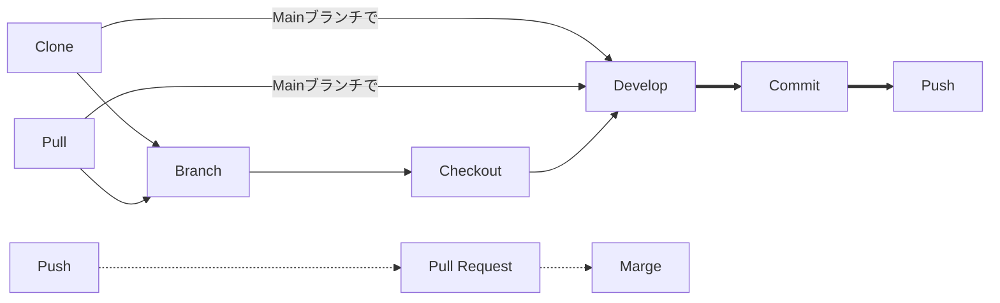
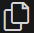
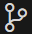
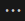

# このドキュメントの目的

- リポジトリをクローンしてブランチして機能追加してコミットする、の意味を理解する/できるようにする
- GitHubを用いて、バージョン管理を適切に行いながら開発が行えるようにする

# 概論

Google Driveにファイルを追加して書き換えて、それをもとにまた書き換えて...  
これのデメリットはたくさんある。挙げてみよう

- 間違えて以前のデータを消しちゃったけど戻せない！
- 誰かがDriveの中身を変えたら毎回それを手動でダウンロードしないといけない
- 変更された場所が分かりづらい
- 同時並行で機能追加・開発がしづらい

上記のようにデメリットが多い。これを解決したいという動機がわく  
そのようなときに便利なのがGitによるバージョン管理とGitHubによるクラウド管理（のようなモノ）である

## 前提知識

### GitとGitHub

#### Gitとは？

ファイル群をバージョン管理するためのツール  
各PCにそれぞれ入っていて、「誰が」「いつ」「どこを」変更したのかという履歴を保存する  
また、その履歴から、復元したり差分を確認したりすることができる  

#### GitHubとは？

Gitをクラウド的に使えるようにするためのサービス  
Web上にファイル群を保存し、各PCからGitを通して変更履歴の送受信をする  
グループで開発をしやすくするための機能がいくつか追加されている  

#### 違いを見る

### 用語

> [!NOTE]
> [サル先生のGit入門](https://backlog.com/ja/git-tutorial/)

#### 一般編

- リポジトリ (Repository)
  - バージョン管理をされるファイル群（フォルダ）の情報が詰まったデータベースのようなもの

> [!IMPORTANT]
> リポジトリは、作業フォルダ（やその中のファイル類）と異なる  
> バックアップやセーブデータのように、別に保存されていると考えたほうが分かりやすい

- ローカルリポジトリ (Local Repository)
  - 各PCごとに作成されるリポジトリ、Gitで管理する
- リモートリポジトリ (Remote Repository)
  - ネットワーク上で管理されるリポジトリ、今回はGitHub上にある

> [!NOTE]
> [この記事の図](https://qiita.com/Coa3/items/d0a43b22a130f74a2685#2-git%E3%82%92%E7%90%86%E8%A7%A3%E3%81%99%E3%82%8B)を見るとわかりやすい

- コミット (Commit)
  - 作業フォルダの内容を、ローカルリポジトリ（特定のブランチ）に記録すること
- メインブランチ (Main Branch)
  - リポジトリの主となるブランチ
  - 基本的に異常がない状態にされる
- ブランチ (Branch)
  - あるブランチから分岐させたブランチを作成すること
- チェックアウト (Checkout)
  - コミット先のブランチを変更すること
- マージ (Merge)
  - あるブランチを他のブランチ（例えばMainブランチ）に取り込むこと

#### Git-GitHub間編

- クローン (Clone)
  - リモートリポジトリ（の特定のブランチ）の内容をコピーし、ローカルリポジトリにコピーすること
- プル (Pull)
  - （現在のブランチの）リモートリポジトリの変更内容をローカルリポジトリに反映させること
- プッシュ (Push)
  - （現在のブランチの）ローカルリポジトリの変更内容をリモートリポジトリに反映させること

> [!NOTE]
> 現在のブランチではないブランチは、VSCodeのGUI上ではプルされない  
> プルしたいブランチにチェックアウトしてから、そのブランチでプルしよう  
> めんどくさい人は`git pull --all`で全てのブランチを取得しちゃおう  
> （追跡していないブランチは`git fetch --all`だけでいいのかな？わからん  
> cf. <https://qiita.com/muraikenta/items/e590a380191971f9c4c3>

---

# GitHubを使おう

## 実際の開発の流れ

### GitHub上での操作

### VSCode上でGitHubのコマンドを使う

## GitHub CLI コマンド集

> ref.
>
> [GitHubを完全に理解したい #1 Gitを理解する](https://qiita.com/Coa3/items/d0a43b22a130f74a2685)  
> [君には1時間でGitについて知ってもらう(with VSCode)](https://qiita.com/jesus_isao/items/63557eba36819faa4ad9)  
> [Gitの仕組みと用語 / GitHub Term](https://speakerdeck.com/kaityo256/github-term)  

# 1. このドキュメントの目的

- リポジトリをクローンしてブランチして機能追加してコミットする、の意味を理解する/できるようにする
- GitHubを用いて、バージョン管理を適切に行いながら開発が行えるようにする

# 2. 概論

Google Driveにファイルを追加して書き換えて、それをもとにまた書き換えて...  
これのデメリットはたくさんある。挙げてみよう

- 間違えて以前のデータを消しちゃったけど戻せない！
- 誰かがDriveの中身を変えたら毎回それを手動でダウンロードしないといけない
- 変更された場所が分かりづらい
- 同時並行で機能追加・開発がしづらい

上記のようにデメリットが多い。これを解決したいという動機がわく  
そのようなときに便利なのがGitによるバージョン管理とGitHubによるクラウド管理（のようなモノ）である

## 2.1. 前提知識

### 2.1.1. GitとGitHub

#### 2.1.1.1. Gitとは？

ファイル群をバージョン管理するためのツール  
各PCにそれぞれ入っていて、「誰が」「いつ」「どこを」変更したのかという履歴を保存する  
また、その履歴から、復元したり差分を確認したりすることができる  

#### 2.1.1.2. GitHubとは？

Gitをクラウド的に使えるようにするためのサービス  
Web上にファイル群を保存し、各PCからGitを通して変更履歴の送受信をする  
グループで開発をしやすくするための機能がいくつか追加されている  

#### 2.1.1.3. 違いを見る

### 2.1.2. 用語

> [!NOTE]
> [サル先生のGit入門](https://backlog.com/ja/git-tutorial/)はイラスト付きで分かりやすい
> 見出し語にリンクを貼り付けているのでぜひ確認を

#### 2.1.2.1. 一般編

- [リポジトリ](https://backlog.com/ja/git-tutorial/intro/02/) (Repository)
  - バージョン管理をされるファイル群（フォルダ）の情報が詰まったデータベースのようなもの

> [!IMPORTANT]
> リポジトリは、作業フォルダ（やその中のファイル類）と異なる  
> バックアップやセーブデータのように、別に保存されていると考えたほうが分かりやすい

- ローカルリポジトリ (Local Repository)
  - 各PCごとに作成されるリポジトリ、Gitで管理する
- リモートリポジトリ (Remote Repository)
  - ネットワーク上で管理されるリポジトリ、今回はGitHub上にある

> [!NOTE]
> [この記事の図](https://qiita.com/Coa3/items/d0a43b22a130f74a2685#2-git%E3%82%92%E7%90%86%E8%A7%A3%E3%81%99%E3%82%8B)を見るとわかりやすい

- [コミット](https://backlog.com/ja/git-tutorial/intro/03/) (Commit)
  - 作業フォルダの内容を、ローカルリポジトリ（特定のブランチ）に記録すること
- メインブランチ (Main Branch)
  - リポジトリの主となるブランチ
  - 基本的に異常がない状態にされる
- [ブランチ](https://backlog.com/ja/git-tutorial/stepup/01/) (Branch)
  - あるブランチから分岐させたブランチを作成すること
- チェックアウト (Checkout)
  - コミット先のブランチを変更すること
  - 閲覧・編集対象のブランチを変更します！

#### 2.1.2.2. Git-GitHub間編

- [クローン](https://backlog.com/ja/git-tutorial/intro/10/) (Clone)
  - リモートリポジトリ（の特定のブランチ）の内容をコピーし、ローカルリポジトリにコピーすること
- [マージ](https://backlog.com/ja/git-tutorial/stepup/04/) (Marge)
  - あるブランチを他のブランチ（例えばMainブランチ）に取り込むこと
  - プルもプッシュもマージしていると捉えられる
- [プル](https://backlog.com/ja/git-tutorial/intro/11/) (Pull)
  - （現在のブランチの）リモートリポジトリの変更内容をローカルリポジトリに反映させること
  - クラウドからダウンロードするようなもの
- [プッシュ](https://backlog.com/ja/git-tutorial/intro/09/) (Push)
  - （現在のブランチの）ローカルリポジトリの変更内容をリモートリポジトリに反映させること
  - クラウドにアップロードするようなもの

> [!NOTE]
> 現在のブランチではないブランチは、VSCodeのGUI上ではプルされない  
> プルしたいブランチにチェックアウトしてから、そのブランチでプルしよう  
> めんどくさい人は`git pull --all`で全てのブランチを取得しちゃおう  
> （追跡していないブランチは`git fetch --all`だけでいいのかな？わからん  
> cf. <https://qiita.com/muraikenta/items/e590a380191971f9c4c3>

#### GitHub内編

- プルリクエスト (Pull Request)
  - あるブランチの内容を、他のブランチに取り込むよう依頼すること
  - 異なるリポジトリのブランチでもプルリクエストは行える
  - 略称: プルリク、PR

---

# 3. GitHubを使おう

## 3.1. 実際の開発の流れ

> cf. <https://backlog.com/ja/git-tutorial/pull-request/03/>

### 3.1.1. ローカルリポジトリの作成

- クローンしたいリポジトリを開いてをクリックし、からURLをコピーする
- VSCode上でを開き、「リポジトリの複製」をクリックする
- 「リポジトリURLか～～」でURLをペーストし、「リポジトリのURL」を選択
- データを保存したい適当なフォルダを宛先として選択する
- 開くと完了。ローカルリポジトリの作成 done!

### 3.1.2. VSCode上でGitHubのコマンドを使う

- VSCode上でを開き、から色々なGitコマンドを実行することができる
- bashターミナルを起動してGitコマンドを打つことでも実行できるが、今回は省略

## 3.2. GitHub CLI コマンド集

> ref.
>
> [GitHubを完全に理解したい #1 Gitを理解する](https://qiita.com/Coa3/items/d0a43b22a130f74a2685)  
> [君には1時間でGitについて知ってもらう(with VSCode)](https://qiita.com/jesus_isao/items/63557eba36819faa4ad9)  
> [Gitの仕組みと用語 / GitHub Term](https://speakerdeck.com/kaityo256/github-term)  
